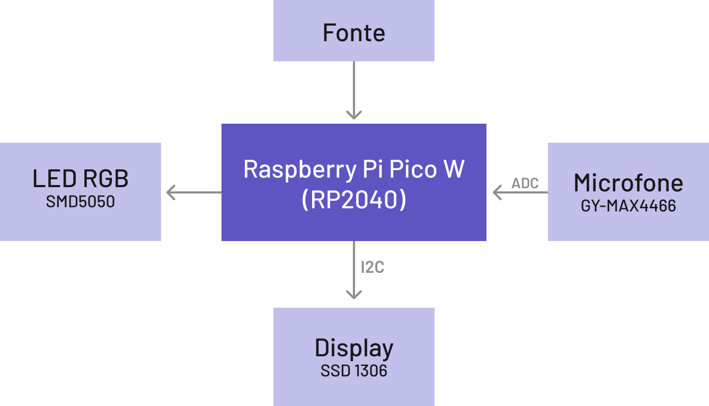

# Projeto Final

Projeto Final do curso EmbarcaTech, implementado pelo aluno Jônatas da Silva, para composição de nota final.

## O projeto

Título: **Sistema de monitoramento sonoro para detecção de anomalias em ambientes residenciais e empresariais** 

Este projeto consiste no desenvolvimento de um sistema embarcado de monitoramento sonoro,  capaz de detectar variações, e com isso realiza o monitoramento periódico de um ambiente para identificar variações sonoras significativas e eventos incomuns.  Utilizando um microfone, um microcontrolador (Raspberry Pi Pico W), um LED RGB e um display OLED 1306.
A detecção ocorre com base nas  variações sonoras (graves e agudos), que podem indicar diversos eventos, como invasões de propriedade, incêndios, terremotos e ventanias. Ao identificar uma anomalia, o sistema aciona alertas visuais, ao acender o LED RGB, e exibe a onda detectada no display, permitindo visualizar os eventos críticos detectados.

## Objetivo

O projeto tem como principal objetivo desenvolver um sistema de monitoramento sonoro capaz de identificar variações extremas no ambiente (graves e agudos), permitindo a detecção de anomalias e eventos incomuns.

Os objetivos específicos incluem:

- Monitoramento – Implementa um sistema de captura sonora e análise do ambiente em um determinado período, capturando e processando variações sonoras;
- Detecção de Anomalias – Identificar padrões sonoros incomuns que possam indicar situações atípicas ou emergenciais;
- Sinal de Alertas – Emitir sinal luminoso em caso de detecção de eventos suspeitos, como invasões, incêndios, terremotos ou ventanias;
- Prevenção e Segurança – Auxiliar na proteção de propriedades, garantindo uma rápida detecção de possíveis ameaças sonoras no ambiente.

## Descrição do funcionamento

### Visão Geral

O projeto consiste em um monitor de níveis sonoros utilizando o Raspberry Pi Pico W, um microfone conectado ao ADC para captação de som, LEDs para indicação visual dos níveis de ruído e um display OLED SSD1306 para exibição gráfica das ondas sonoras coletadas.

### Funcionalidades

#### Captura de Som

- Um microfone analógico é conectado ao ADC do Raspberry Pi Pico W;
- O sinal captado é convertido em valores digitais, permitindo a análise da intensidade do som;
- O código calcula a amplitude do som para determinar os níveis de ruído ambiente.

#### Indicação Visual por LED RGB

- O LED RGB é composto por 3 LEDs: vermelho, azul e verde;
- LEDs são utilizados como indicadores visuais dos níveis sonoros;
- Conforme a intensidade do som é grave, o LED azul é aceso;
- Conforme a intensidade do som é agudo, o LED vermelho é aceso;
- Em caso da intensidade estar em níveis considerados normais o LED verde fica ligado;
- Cada LED representa uma intensidade de captura, possibilitando uma leitura rápida da situação sonora.

#### Exibição de onda sonora no Display OLED SSD1306

- Display OLED de 0,96 polegadas (64 x 128 pixels) exibe informações gráficas dos níveis de som;
- A interface gráfica inclui um gráfico de linha, que representa os valores numéricos da intensidade sonora;
- O display é atualizado em tempo real conforme as leituras do microfone.

### Funcionamento

O microfone capta os sons do ambiente e envia sinais analógicos para o ADC do Raspberry Pi Pico W. O microcontrolador converte o sinal em um valor flutuante, o qual é  processado, e através dos valores obtidos o sinal sonoro é coletado e construído um vetor com a amostra da onda sonora. Os LEDs acendem de acordo com o nível sonoro detectado e o display exibe o gráfico da onda sonora.

Nesse projeto, é possível visualizar e monitorar em tempo real os níveis de ruído de um ambiente, oferecendo feedback visual imediato.

## Justificativa

A necessidade de sistemas de monitoramento residenciais e empresariais eficazes tem crescido à medida que a segurança e a prevenção de eventos anômalos se tornam prioridades em diversos setores. Este projeto visa gerar uma alternativa simples e barata para essa demanda por meio de um sistema de monitoramento sonoro simples e eficiente, capaz de identificar variações sonoras significativas em um ambiente e alertar sobre possíveis anomalias.

A detecção de eventos é baseada na análise de frequências sonoras (graves e agudas), permitindo a identificação de situações como invasões de propriedade, incêndios, terremotos e ventanias. Essa abordagem possibilita uma detecção e resposta rápida a emergências, contribuindo para a segurança de pessoas e patrimônios.

O sistema é composto por um microfone, responsável pela captura dos sons do ambiente; um LED RGB, que fornece indicações visuais imediatas sobre o status do monitoramento; e um display 1306, utilizado para exibir informações da onda sonora capturada em tempo real. Esses componentes garantem uma solução acessível e de fácil implementação para diversas aplicações, desde a segurança residencial até a detecção de desastres naturais.

Por ser um sistema simples, compacto e de baixo custo, sua aplicação pode ser expandida para diferentes cenários e incorporada a outros sistemas que realizam a tomada de decisão, tornando-o uma alternativa viável para monitoramento e alerta em tempo real.

## Originalidade

Este projeto se diferencia por sua simplicidade e eficiência na detecção de variações sonoras utilizando apenas três componentes essenciais:
- Microfone: capta os sons do ambiente;
- LED RGB: fornece alertas visuais em tempo real;
- Display OLED 1306: exibe a onda sonora detectada.
  
Diferente de outras soluções que utilizam sensores múltiplos e tecnologias complexas, este projeto foca exclusivamente na detecção de pontos extremos da onda sonora para identificar eventos incomuns. Sua abordagem minimalista torna-o acessível, compacto e de fácil implementação, sem comprometer a funcionalidade.

Essa proposta oferece uma solução inovadora para monitoramento residencial e segurança, diferenciando-se de projetos tradicionais que dependem de sensores de movimento ou fumaça, entre outros.

## Diagrama de blocos

## Função de cada bloco

### Raspberry Pi Pico W

A placa central detentora do microcontrolador RP2040 (dual-core ARM Cortex-M0+), conta com os componentes: 
- 264 KB de SRAM;
- 2 MB de memória flash (para armazenamento de programas);
- 26 pinos GPIO multifuncionais;
- suporte a PWM, I2C, SPI, UART, ADC, etc;
- 1.8 – 3.3V (USB ou fonte externa).

### LED RGB SMD5050

O LED RGB SMD5050 é um diodo (cátodo) emissor de luz (LED) que combina três LEDs (vermelho, verde e azul) em um único encapsulamento SMD (Surface Mount Device). Ele permite a criação de diversas cores através da mistura de intensidades dos três LEDs.

### Display OLED SSD1306

O Display OLED SSD1306 é um display monocromático de diodos orgânicos emissores de luz (OLED) que utiliza o controlador SSD1306. Ele é amplamente utilizado devido ao seu baixo consumo de energia e alta qualidade de exibição. Ele conta com uma resolução de 128x64 pixels, interfaces de conexão I2C ou SPI, sendo que na conexão utilizada I2C temos a seguintes informações:
- SDA: Dados;
- SCL: Clock;
- GND: Terra;
- VCC: Alimentação (3.3V ou 5V).

### Microfone GY-MAX4466

O Microfone GY-MAX4466 é um módulo de microfone amplificado que utiliza o amplificador operacional MAX4466. Ele é projetado para capturar sinais de áudio e amplificá-los para processamento por microcontroladores.

## Descrição da pinagem usada

O Raspberry Pi Pico W possui 40 pinos GPIO, dos quais 26 são programáveis. Abaixo está a lista e descrição dos pinos utilizados no projeto:

### Display OLED SSD1306 (I2C)

| Pino Raspberry Pi Pico W  |  Pino Display OLED SSD1306 | Função |
| ------------- | ------------- | ------ |
| GPIO 14  | SDA  | Dados I2C (Serial Data) |
| GPIO 15  | SCL  | Clock I2C (Serial Clock) |
| 3V3 (OUT) | VCC | Alimentação (3.3V) |
| GND | GND | Terra (Ground) |

Obs.: Os resistores de pull-up (2.2 kΩ a 10 kΩ) são necessários nos pinos SDA e SCL, mas podem ser ativados internamente no Raspberry Pi Pico W usando gpio_pull_up.

### LED RGB SMD5050

| Pino Raspberry Pi Pico W  |  Pino LED RGB SMD5050 | Função |
| ------------- | ------------- | ------ |
| GPIO 13  | R  | LED Vermelho |
| GPIO 11  | G  | LED Verde |
| GPIO 12 | B | LED Azul |
| GND | GND | Terra (Ground) |

### Microfone MAX4466

| Pino Raspberry Pi Pico W  |  Pino Microfone MAX4466 | Função |
| ------------- | ------------- | ------ |
| GPIO 28  | OUT  | Saída de sinal analógico |
| 3V3 (OUT)  | VCC  | Alimentação (3.3V) |
| GND | GND | Terra (Ground) |

## Utilização

O projeto deve ser importado pela extensão Raspberry Pi Pico, e em seguida compilado utilizando a mesma extensão, após estes passos pode ser utilizada a extensão para passar o firmware para o Pi Pico, usando o processo: Run Project (USB).

## Conclusão

O projeto desenvolvido com o Raspberry Pi Pico W demonstra a versatilidade e o potencial dessa plataforma para aplicações embarcadas. Através da integração de componentes como o Display OLED SSD1306, LED RGB SMD5050 e Microfone MAX4466, sendo possível construir um sistema funcional, simples e interativo que combina hardware e software de forma eficiente.

A combinação desses componentes resultou em um sistema coeso, capaz de realizar tarefas complexas, como monitoramento de som, exibição gráfica e feedback visual luminoso.

A utilização do protocolo I2C para comunicação com o display OLED foi um aprendizado valioso, destacando a importância de configurar corretamente os resistores de pull-up e os endereços dos dispositivos.

A leitura de sinais analógicos com o ADC do Raspberry Pi Pico W mostrou-se eficaz para processar dados de sensores, como o microfone.

Este projeto demonstrou a importância de uma abordagem sistemática para o desenvolvimento de sistemas embarcados. A combinação de hardware e software, aliada à criatividade e ao planejamento, permite a criação de soluções inovadoras e eficientes. Com os conhecimentos adquiridos, é possível explorar novas funcionalidades e expandir o projeto para atender a uma variedade de necessidades e aplicações.

Em resumo, o projeto foi um sucesso, proporcionando uma base sólida para futuras explorações e desenvolvimentos na área de sistemas embarcados.

## Aplicações Futuras:

O projeto pode ser expandido para diversas aplicações práticas, tais como:

Sistemas de monitoramento ambiental: Utilizando o microfone para detectar sons específicos, como alarmes ou ruídos anormais.

Interfaces gráficas avançadas: Incorporando mais funcionalidades ao display OLED, como menus interativos e gráficos em tempo real.

Controle de iluminação: Aproveitando o LED RGB para criar sistemas de iluminação inteligente e personalizada.

Projetos de IoT: Integrando a conectividade Wi-Fi do Raspberry Pi Pico W para enviar dados para a nuvem ou controlar dispositivos remotamente.
